# Predict Clicked Ads Customer Classification by using Machine Learning

In this project, we have been given a task to evaluate advertising policy at e-commerce and forecast future income shall machine learning is used.

1. ratio on clicked ads and not-clicked

2. EDA on features             
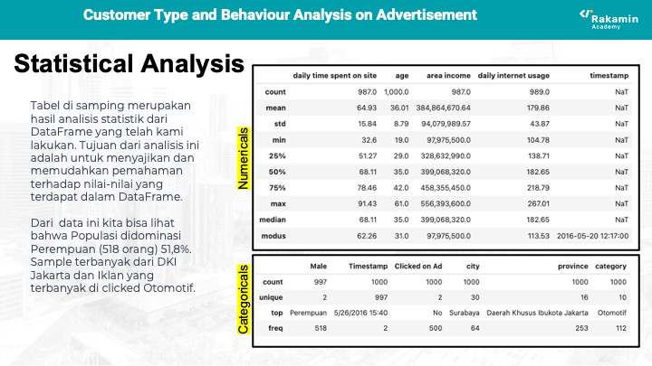     
3. 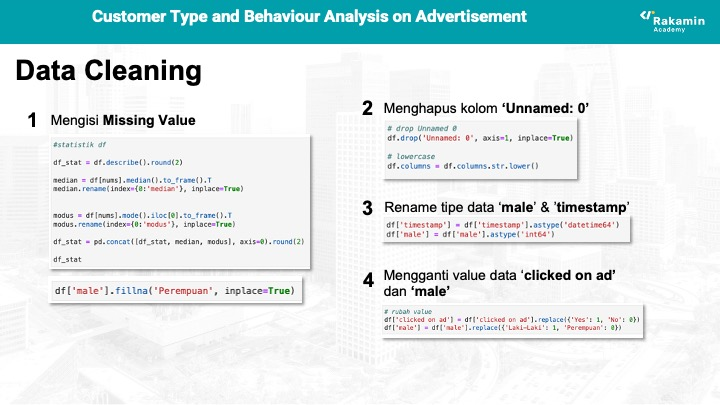
4. 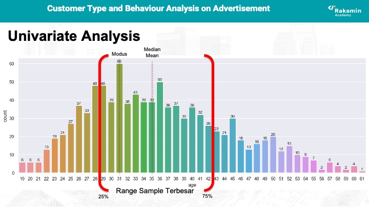
5. 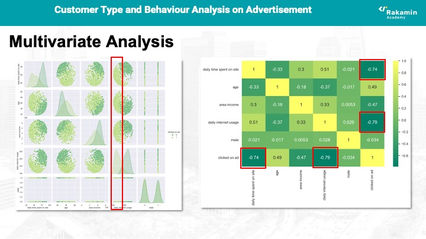
6. 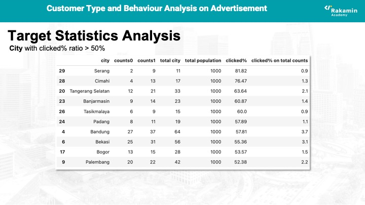
7. 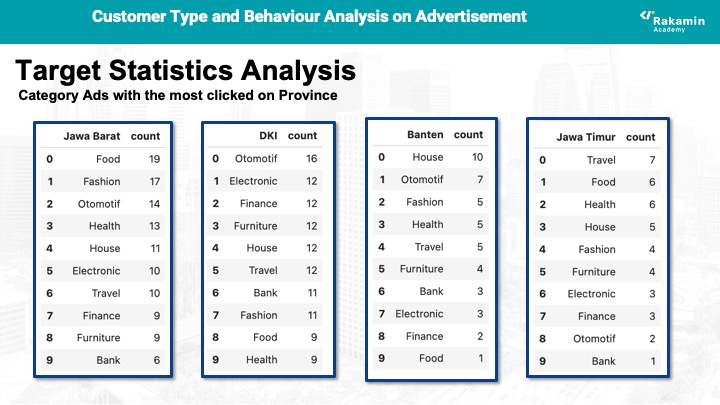
8. 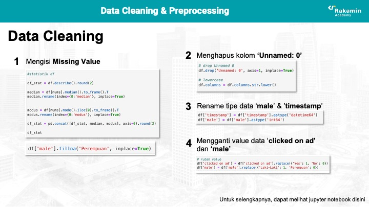
9. 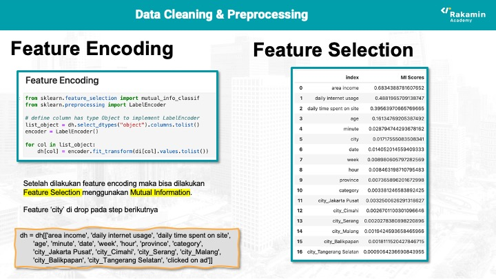
10. 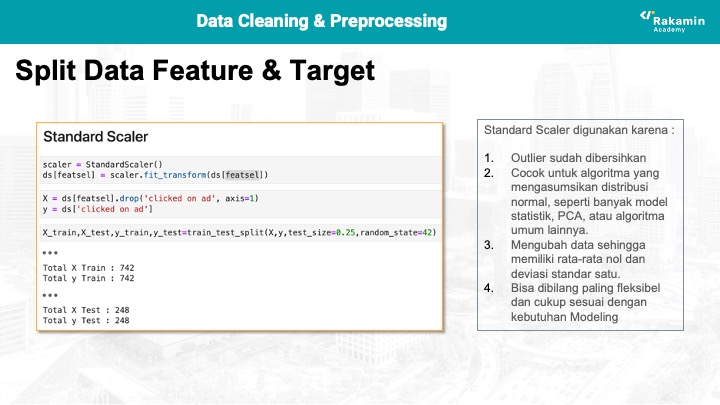
11. 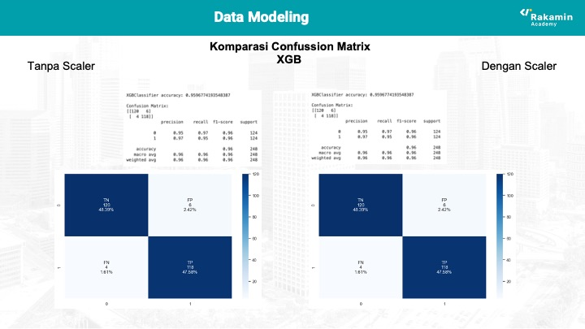
12. 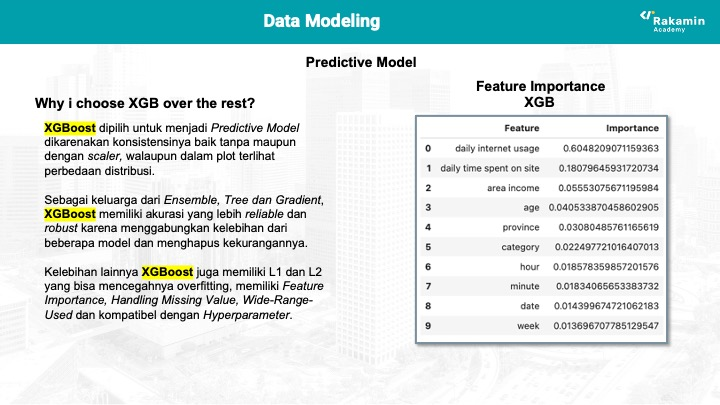
13. 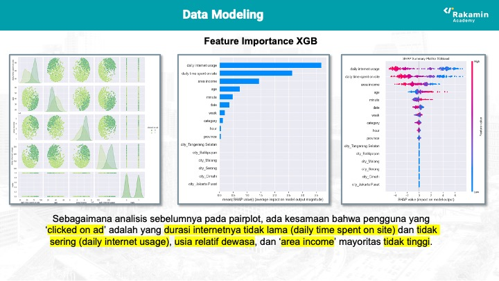
14. 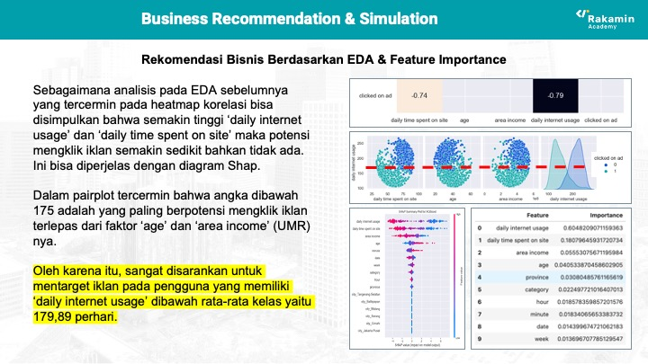
15. 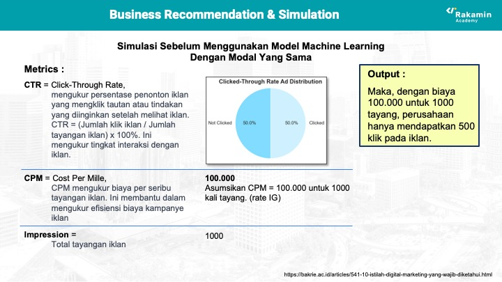
16. 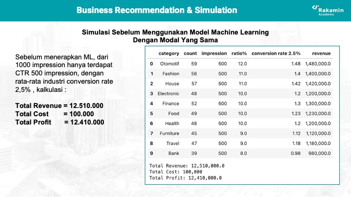
17. 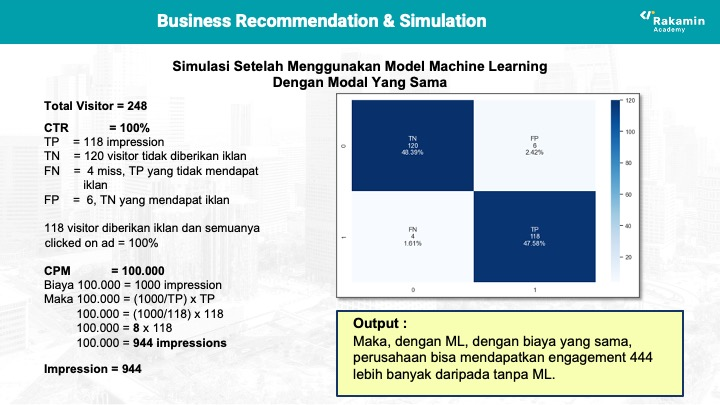
18. 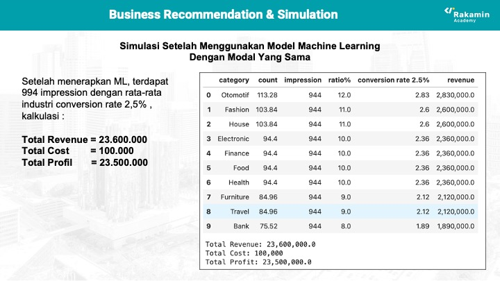
19. 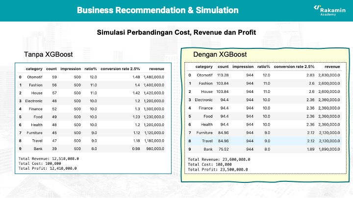

Summary :
therefore we have come into conclusion that machine learning is valuable tools to enhave company profit.

> Written with [StackEdit](https://stackedit.io/).
